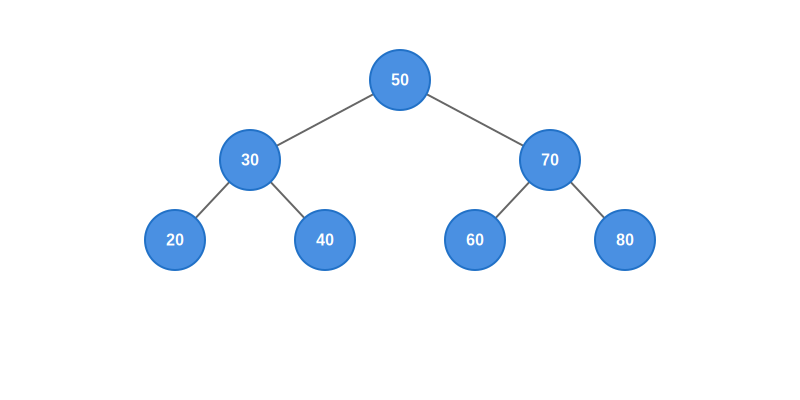

# FuncLang Binary Search Tree Implementation



A pure functional implementation of a Binary Search Tree (BST) data structure in FuncLang, demonstrating immutable data structures and functional programming principles. This implementation provides efficient search, insertion, and traversal operations while maintaining the BST property.

## Features

- **Pure Functional Implementation**: All operations create new trees instead of modifying existing ones
- **Immutable Data Structure**: Ensures thread-safety and predictable behavior
- **Efficient Operations**: O(log n) average case complexity for search and insertion
- **Comprehensive Interface**:
  - Tree Construction (`bst`)
  - Value Insertion (`insert`)
  - In-order Traversal (`getlist`)
  - Tree Structure Visualization (`gettree`)

## Usage

```scheme
;; Create a new BST
(define t0 (bst (list)))

;; Insert values
(define t1 (insert t0 (list 50 30 70 20 40 60 80)))

;; Get sorted list of values
(getlist t1)
;; Output: (20 30 40 50 60 70 80)

;; Get tree structure
(gettree t1)
;; Output: (50 (30 (20 () ()) (40 () ())) (70 (60 () ()) (80 () ())))
